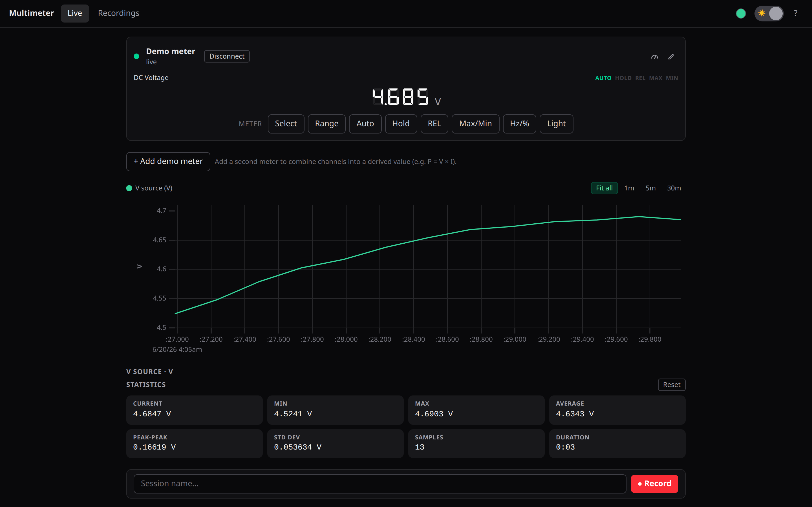
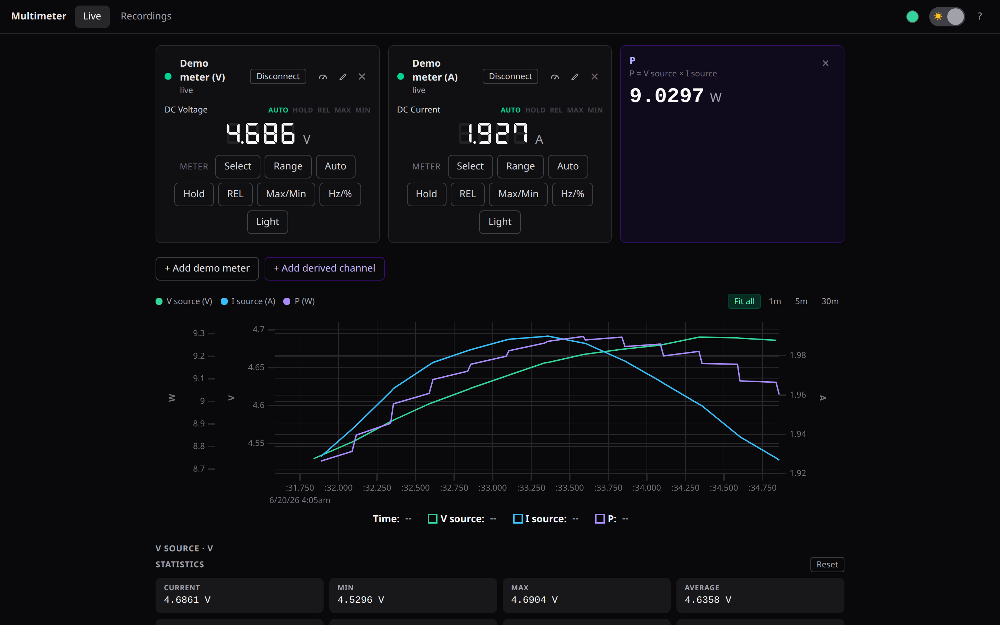
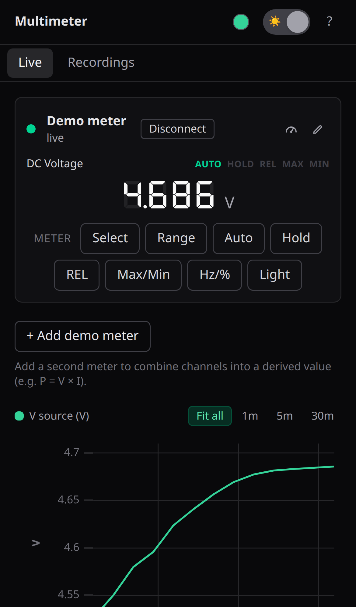
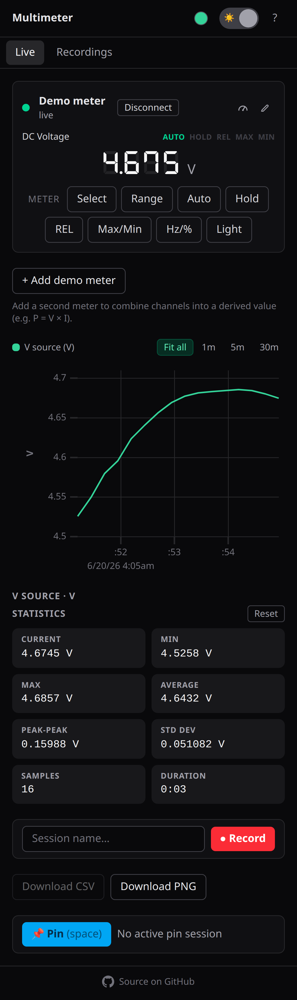
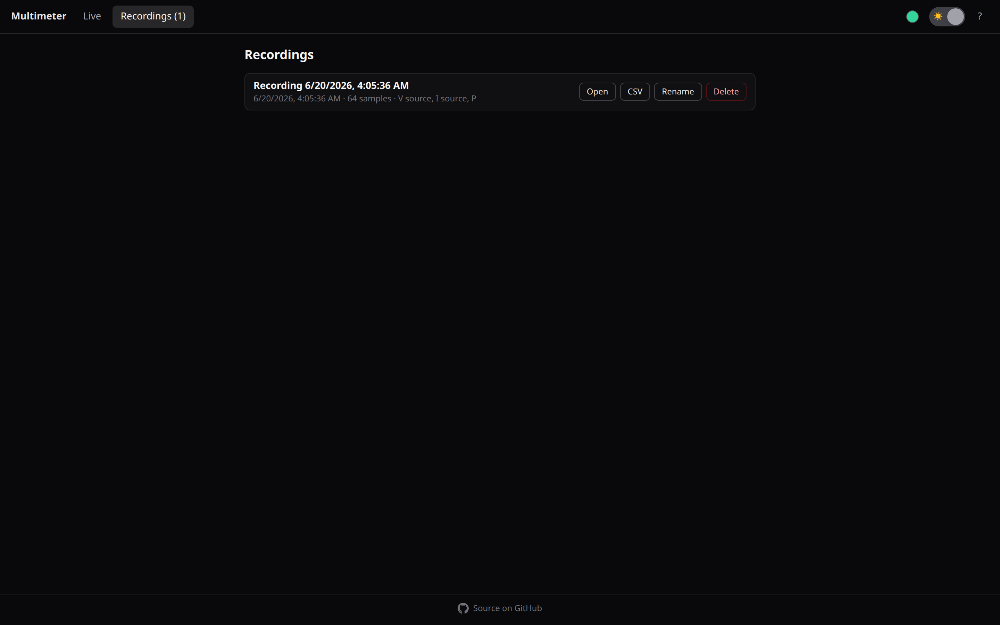
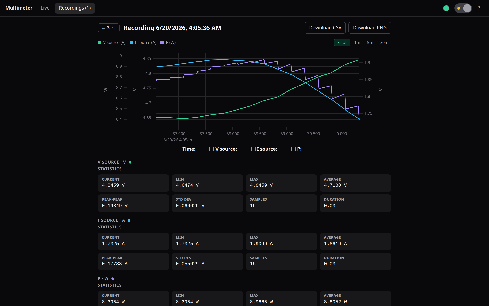
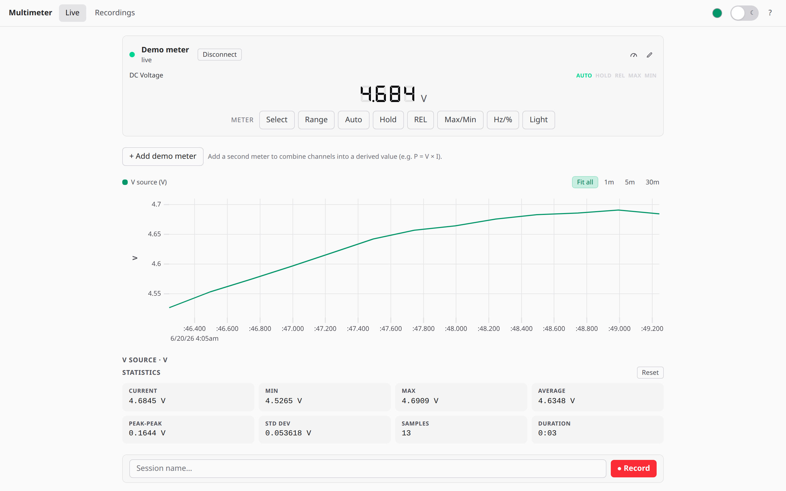
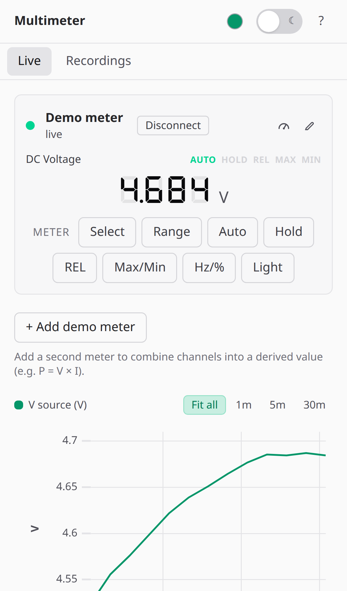

# Multimeter

[](https://github.com/libreble/multimeter/actions/workflows/ci.yml)
[](https://codecov.io/gh/libreble/multimeter)

A browser companion for Bluetooth multimeters — **UNI-T, OWON, Aneng, BSIDE/ZOYI, Voltcraft &
AICARE** — with a live, full-screen readout, charting, statistics, recording, and CSV/PNG export.
It runs entirely in your browser over
[Web Bluetooth](https://developer.mozilla.org/docs/Web/API/Web_Bluetooth_API) —
no install, no account, no data leaves your machine — and installs as an offline PWA.

**Open the app: <https://libreble.github.io/multimeter/>** — installable, works offline. Needs Chrome on
Android or Chrome/Edge on desktop (Web Bluetooth). No account, no cloud.
[Try the demo](https://libreble.github.io/multimeter/?demo) (no meter needed).

Part of [libreble](https://libreble.github.io) — your devices, set free.

<p align="center">
  
</p>

## Features

- **Live readout** — a big, glanceable hero value with function, AC/DC, and range badges.
- **Charting** — a rolling live chart (uPlot) with Fit-all / 1m / 5m / 30m windows and a
  pick of five line colors; range changes (kΩ↔MΩ) stay continuous because values are
  normalized to SI.
- **Statistics** — current, min, max, average, peak-to-peak, std-dev, sample count, duration.
- **Recording** — capture sessions to IndexedDB; they survive a reload. Pause / resume / stop.
- **Export** — download any session as **CSV**, or the chart as a **PNG**.
- **Hold, Pin & Copy** — freeze the readout, pin a value to read hands-free while the stream
  runs, or copy the current reading to the clipboard.
- **Full function coverage** — V / A / Ω, continuity, diode, capacitance, frequency, duty %,
  temperature, and NCV.
- **Multiple meters at once** — connect several meters and watch them side by side on one bench
  view (e.g. a V and an A meter for live power).
- **PWA** — installable, works offline, light/dark theme that also drives the system UI bars.
- **Keyboard-driven & accessible** — full shortcut set and a screen-reader announce key.

## Screenshots

**Multiple meters on one bench** — connect several at once (here a V and an A meter) with a live
**P = V × I** derived channel, all on one synchronized chart:

<p align="center">
  
</p>

<p align="center">
  
</p>

<p align="center">
  
  &nbsp;&nbsp;
  
  &nbsp;&nbsp;
  
</p>

<p align="center">
  
  
</p>

**Light theme too** — toggle with one tap (or the `t` key); line color is a preset as well
(violet and sky shown here):

<p align="center">
  
  &nbsp;&nbsp;
  
</p>

## Requirements

Web Bluetooth is required, which means a **Chromium-based browser** in a secure context
(HTTPS or `localhost`):

| Platform                                | Works | Notes                                                          |
| --------------------------------------- | ----- | -------------------------------------------------------------- |
| Chrome / Edge / Brave / Opera (desktop) | ✅    | Linux, macOS, Windows, ChromeOS                                |
| Chrome (Android)                        | ✅    | Connect the meter directly from the phone                      |
| Firefox / Safari                        | ❌    | No Web Bluetooth                                               |
| iOS / iPadOS                            | ❌    | No Web Bluetooth (works only via a WebBLE browser like Bluefy) |

Power on the meter, then click **Connect** and choose it in the browser's device chooser.

## Getting started

This is a [pnpm](https://pnpm.io) workspace: the app lives in `apps/web` and the reusable logic
is split into packages under `packages/` (see [Packages](#packages)).

```bash
pnpm install
pnpm dev         # Vite dev server for apps/web (also on the LAN for phone testing)
pnpm build       # build every package + the app
pnpm test        # all unit tests (vitest)
pnpm typecheck   # tsc across the workspace
pnpm lint        # eslint across the workspace
```

> **No meter handy?** Append `?demo` to the URL (e.g. `localhost:5173/multimeter/?demo`)
> to drive the whole UI from a synthetic measurement stream — handy for development and the
> screenshots above. Demo mode needs no Bluetooth, so it runs in any browser (Firefox and
> Safari included).

## Self-host

The hosted app above is the easiest way. If you'd rather run your own copy, it's a static site —
nothing to configure, no backend, no database.

**Docker** — a prebuilt image (linux/amd64 + arm64) is published to the GitHub Container Registry:

```bash
docker run -d --name multimeter -p 8080:8080 --restart unless-stopped ghcr.io/libreble/multimeter
# → http://localhost:8080/
```

```yaml
# compose.yaml
services:
  multimeter:
    image: ghcr.io/libreble/multimeter:latest
    ports: ["8080:8080"]
    restart: unless-stopped
```

The image serves the app at `/`. To serve it under a subpath behind your own proxy, build it
yourself: `docker build --build-arg BASE_PATH=/multimeter/ -t multimeter .`

**Build and host it yourself** — any static web server works:

```bash
pnpm install --frozen-lockfile
BASE_PATH=/ pnpm --filter web build      # → apps/web/dist/
# upload apps/web/dist/ to nginx, Caddy, Netlify, Cloudflare Pages, a bucket, …
```

Set `BASE_PATH` to the path you serve from (it defaults to `/multimeter/`, the GitHub Pages path).
Serve `index.html` and `sw.js` with `Cache-Control: no-cache` so updates reach installed copies.
[`docker/nginx.conf.template`](docker/nginx.conf.template) is a working nginx example.

> **HTTPS is required.** Web Bluetooth only works in a secure context. `http://localhost` counts,
> so the app works on the machine running it — but `http://192.168.x.x:8080` from your phone
> will load and then refuse to connect. For phones, put it behind TLS: a reverse proxy with a
> real certificate (Caddy does this automatically for a domain), or `tailscale serve`.

Self-hosted copies keep their `<link rel="canonical">` pointing at libreble.github.io, so
search engines don't treat them as duplicates.

## Keyboard shortcuts

| Key     | Action                   | Key | Action                   |
| ------- | ------------------------ | --- | ------------------------ |
| `c`     | Connect / disconnect     | `e` | Export CSV               |
| `b`     | Toggle backlight         | `i` | Export chart PNG         |
| `h`     | Hold / release           | `v` | Switch Live / Recordings |
| `Space` | Pin current reading      | `s` | Announce reading (a11y)  |
| `r`     | Start / stop recording   | `t` | Toggle light / dark      |
| `p`     | Pause / resume recording | `?` | Show this help           |

## How it works

Each meter speaks a simple BLE protocol: the app subscribes to a notify characteristic, runs the
meter's handshake, and decodes each measurement frame into a reading (function, value, unit, flags).
Decode logic is pure and unit-tested against captured frames. Decode + framing sit behind a `Driver`
interface in the protocol package, so meters from several vendors are supported and new ones can be
added without touching the transport, recording, or UI.

## Supported meters & protocols

The app ships drivers for a range of UNI-T and generic Bluetooth multimeters across several vendors —
UNI-T, Aneng / BSIDE / ZOYI, Owon, Voltcraft, and AICARE. See the
**[hardware support list](docs/HARDWARE.md)** for every model and its verification state, and
**[docs/protocols/](docs/protocols/README.md)** for a per-driver protocol spec.

Most drivers haven't met a real meter yet. When yours connects, the app asks whether it reads
right and opens a pre-filled [device report](https://github.com/libreble/multimeter/issues/new?template=device-report.yml)
— the meter's advertised name and Bluetooth layout, no readings. If your meter isn't in the list
or won't connect, dismissing the chooser offers a
[connection-problem report](https://github.com/libreble/multimeter/issues/new?template=connection-problem.yml).
Nothing is sent from the app; you review and submit the issue on GitHub.

## Packages

The app is a thin shell over framework-agnostic packages, so you can build your own
BLE-multimeter UI (in React **or** Vue) or a headless Node tool on top:

| Package                               | What it is                                                                                                                                                                |
| ------------------------------------- | ------------------------------------------------------------------------------------------------------------------------------------------------------------------------- |
| `@libreble/multimeter-protocol`      | Pure, I/O-free core: the `Reading` model + unit tables, the per-vendor decoders/framing, stats/decimate/CSV, and the device-`Driver` interface + registry. Zero deps; Node-safe. |
| `@libreble/multimeter-web-bluetooth` | Web Bluetooth `Transport` + the framework-agnostic `MeterSession` engine (connect · handshake · keep-alive · reconnect · demo).                                           |
| `@libreble/multimeter-recorder`      | Bluetooth-independent `RecorderSession` · `SessionsStore` · `PinRecorder` engines + the IndexedDB session store.                                                          |
| `@libreble/multimeter-react`         | React hooks: `useMeter` · `useRecorder` · `useSessions` · `usePinSession`.                                                                                                |
| `@libreble/multimeter-vue`           | The same four as Vue composables.                                                                                                                                         |

`apps/web` consumes `@libreble/multimeter-react`, so the app dogfoods the binding it ships.
The packages are structured to be publishable (per-package build → ESM + types) but aren't on
npm yet.

## Tech stack

React 19 · Vue 3 · TypeScript · Vite · Tailwind CSS · uPlot · vite-plugin-pwa · Web Bluetooth ·
IndexedDB · pnpm workspace.

## License

[MIT](LICENSE)

## Support

The app is free and stays that way. If you'd like to support the work anyway: a coffee on
[Ko-fi](https://ko-fi.com/mannes), or — honestly more useful — hardware. A device on the desk is
how it gets an app; if you have one you'd like liberated, say so in a
[device request](https://github.com/libreble/libreble.github.io/issues/new?template=device-request.yml).
